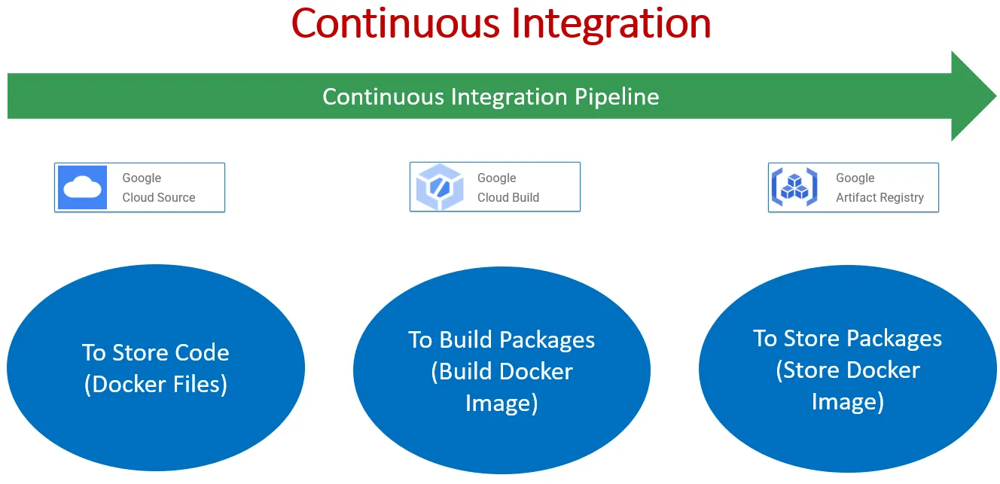
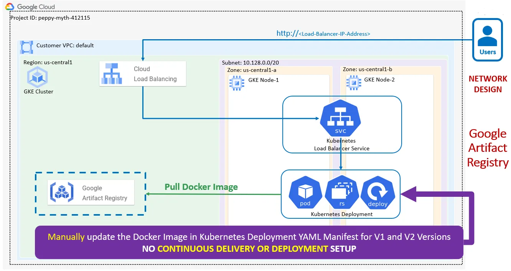

# Terraform on GCP CLoud with GKE K8s DevOps Pipeline

### [View all Roadmaps](https://github.com/nholuongut/all-roadmaps)  ·  [Best Practices](https://github.com/nholuongut/all-roadmaps/blob/main/public/best-practices/)  ·  [Questions](https://www.linkedin.com/in/nholuong/)
 

# **About Me🇻**
- ✍️ Blogger
- ⚽ Football Player
- ♾️ DevOps Engineer
- ⭐ Open-source Contributor
- 😄 Pronouns: Mr. Nho Luong
- 📚 Lifelong Learner | Always exploring something new
- 📫 How to reach me: luongutnho@hotmail.com
  
 

# Oview
- mplement DevOps Pipelines for Terraform Configs on GCP GKE Workloads (Google Kubernetes Engine) the focus is on implementing Continuous Integration (CI) for applications deployed on Google Kubernetes Engine (GKE). 
- Continuous Integration is a development practice where code changes are automatically built, tested, and deployed frequently, ensuring that the application remains stable and ready for production at any time. By integrating CI with GKE, teams can streamline the deployment process, improve code quality, and enhance collaboration among developers.

# Key Objectives:
- Automate Build and Testing: Implement CI pipelines to automate the build and testing processes for containerized applications.
Integrate with Version Control: Connect CI pipelines with version control systems such as Git to trigger builds automatically on code commits.
- Containerize Applications: Ensure that applications are containerized using Docker, allowing for consistent deployment across environments.
Deploy to GKE: Configure CI pipelines to deploy containerized applications to GKE clusters automatically after successful builds and tests.
Monitor CI Pipelines: Set up monitoring and logging to track the performance and status of CI pipelines, enabling rapid identification and resolution of issues.

# Benefits:
- Improved Efficiency: Automating the build, test, and deployment processes streamlines development workflows, reducing manual effort and potential errors.
- Faster Time-to-Market: CI enables rapid iterations and shorter release cycles, allowing teams to deliver new features and updates to production faster.
Enhanced Quality: Continuous testing ensures that code changes are thoroughly validated, resulting in higher-quality software.
- Scalability and Flexibility: GKE provides a scalable and flexible platform for running containerized applications, accommodating changing workload demands effortlessly.

# Prerequisite:

**Installing necessary tools**
In addition to terraform, this guide relies on the gcloud and kubectl tools to view build information and manage the GKE cluster. This means that your system needs to be configured to be able to find terraform, gcloud, kubectl client utilities on the system PATH. Here are the installation guides for each tool:

# Architecture Oview

# Execution flow:

1. Step-01: Create Google Artifact Repository

2. Step-02: Create Access to Google Cloud Source Service from local desktop (SSH Authentication)

3. Step-03: Create Google Cloud Source Git Repository and Clone to local desktop

4. Step-04: Check-In Docker files to Google Cloud Source Git Repository

5. Step-05: Using command “gcloud builds” and test the Build Process

- Cloud Build will pull the Docker files from Cloud Source

- Cloud Build will build a Docker Image and pushes that Docker image to Cloud Artifact Repository

7. Step-07: Create Continuous Integration Pipeline in Google Cloud Build.

8. Step-08: Make changes to index.html (v2) and check-in the code. Cloud Build will trigger the CI Pipeline and creates a new docker image and pushes to Artifact Repository. Verify the same.

9. Step-09: Deploy Kubernetes Manifests with Docker Image V1 and V2 and Test it

10. Step-10: Clean-Up — Undeploy Kubernetes manifests

# Conclusion:
### This project aims to implement GKE Continuous Integration on GCP, leveraging Cloud Build, Cloud Source Repositories, and Artifact Registry to automate software delivery pipelines and streamline application deployment processes. By adopting CI best practices and leveraging GCP’s managed services, the project aims to achieve enhanced reliability, scalability, and efficiency in software development and deployment workflows.

# 🚀 I'm are always open to your feedback.  Please contact as bellow information:
### [Contact Me]
* [Name: Nho Luong]
* [Skype](luongutnho_skype)
* [Github](https://github.com/nholuongut/)
* [Linkedin](https://www.linkedin.com/in/nholuong/)
* [Email Address](luongutnho@hotmail.com)
* [PayPal.me](https://www.paypal.com/paypalme/nholuongut)

# License
* Nho Luong (c). All Rights Reserved.🌟
